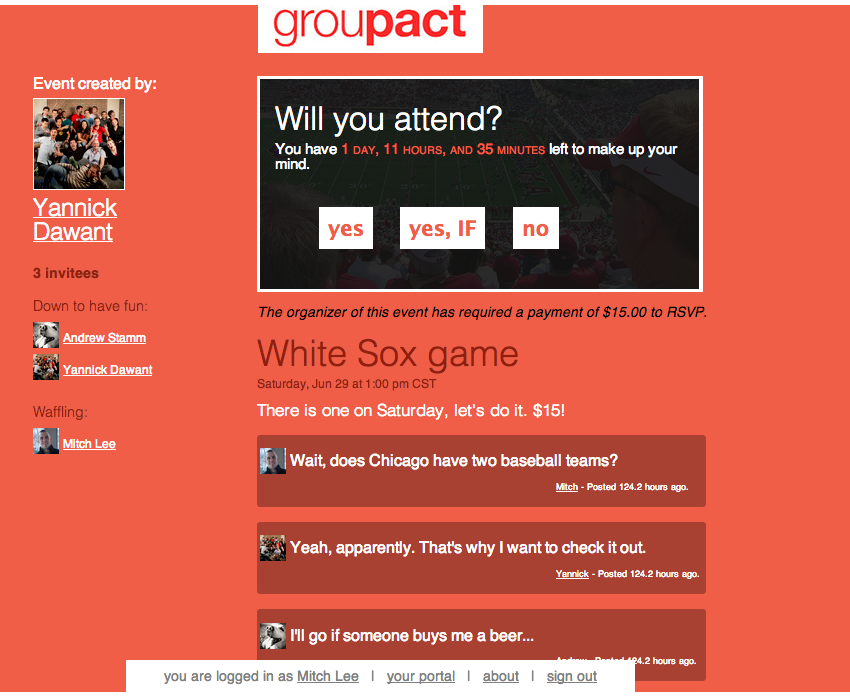

#grouPACT
###Group planning, conditionally.
---

A Rails based web application featuring algorithmic background jobs, mailer integration and Stripe authentication and payment processing. Built by a team of three over the course of eight days, this app required knowledge of the full development stack.

We made heavy use of GitHub for version control, Asana for group planning and task management, and RSpec and Capybara testing for quality control.

This app attempts to solve the problem of wavering commitments from friends when it comes to planning group events. By allowing invitees to explicitly state under what conditions they will attend an event - and then compute whose conditions were ultimately met - the app frees the event planner from the need to track down and otherwise heckle their friends.

Check out the live website at [grouPACT.me](http://groupact.me). Note that currently the payments functionality is set to 'test' (i.e. no real money will be transfered!) and the mailer is live (i.e. people will get emails from you).

To run this app on your local server, make sure you have Rails and Postgres installed and then follow these steps:

    git clone https://github.com/dontmitch/group_planning.git groupact_clone
    cd groupact_clone
    bundle install
    rake db:setup
    rails s

This app requires Stripe and AWS API keys for some of its advanced features. You must provide your own keys in order for those features to work. Also, the seeds file may take a minute to run; we went a bit overboard :wink: .

###Copyright Information

Don't be evil and don't run live clones on the web. Other than that, you are free to use and adapt the code as you please.

*Travis tests are most likely failing due to lack of support for js-based rspec testing.*
